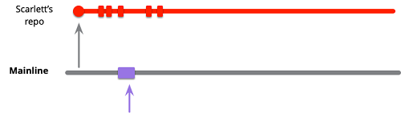
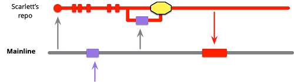
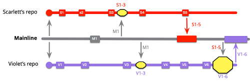
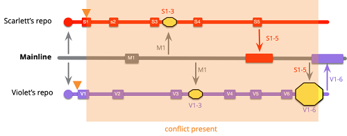
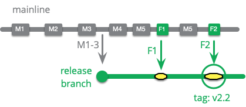

# Patterns for Managing Source Code Branches

TAGS: #articulo #destacado #development

SOURCES: [Patterns for Managing Source Code Branches](https://martinfowler.com/articles/branching-patterns.html) - Martin Fowler

---

## BASE PATTERNS

Two main categories:

- One group looks at integration, how multiple developers combine their work into a coherent whole.
- The other looks at the path to production, using branching to help manage the route from an integrated code base to a product running in production.

Some patterns underpin both of these, and I'll tackle these now as the base patterns.

That leaves a couple of patterns that are neither fundamental, nor fit into the two main groups - so I'll leave those till the end.

### BASE PATTERN: Source Branching

Create a copy and record all changes to that copy.

If several people work on the same code base, it quickly becomes impossible for them to work on the same files. The simple answer to this is for each developer to take a copy of the code base.

A source code control system records every change made to each branch as commit. Not just does this ensure nobody forgets the little change they made, recording changes makes it easier to perform the merge, particularly when several people have changed the same file.

I define a **branch** as a particular sequence of commits to the code base. The **head**, or **tip**, of a branch is the latest commit in that sequence.

The verb, "to branch" it to create a new branch, which we can also think of as splitting the original branch into two. Branches merge when commits from one branch are applied to another.

After cloning a git repository, two developers check out the master branch. They are both working on "master", but their commits are independent of each other and will need to be merged when they push their changes back to the shared repository.

Yf Scarlett decides she's not sure about the changes that she's made, so she tags the last commit and resets her master branch to origin/master (the last commit she cloned from the shared repository).

According to the definition of branch I gave earlier, Scarlett and Violet are working on separate branches, both separate from each other, and separate from the master branch on the shared repository. When Scarlett puts aside her work with a tag, it's still a branch according to my definition (and she may well think of it as a branch), but in git's parlance it's a tagged line of code.

With distributed version control systems like git, this means we also get additional branches whenever we further clone a repository. The same effect occurs with forking in github.

This terminological confusion gets worse when we run into different version control systems as they all have their own definitions of what constitutes a branch. A branch in Mercurial is quite different to a branch in git, which is closer to Mercurial's bookmark. Mercurial can also branch with unnamed heads and Mercurial folks often branch by cloning repositories.

I define a **codeline** as a particular sequence of versions of the code base. It can end in a tag, be a branch, or be lost in git's reflog. You'll notice an intense similarity between my definitions of branch and codeline. Codeline is in many ways the more useful term, and I do use it, but it's not as widely used in practice. So for this article, I'll use branch and codeline interchangeably.

A consequence of this definition is that, whatever version control system you're using, every developer has at least one personal codeline on the working copy on their own machine as soon as they make local changes. If I clone a project's git repo, checkout master, and update some files - that's a new codeline even before I commit anything. Similarly if I make my own working copy of the trunk of a subversion repository, that working copy is its own codeline, even if there's no subversion branch involved.

#### When to use Source Branching

With source code: branching is easy, merging is harder. Source control systems that record every change on the commit do make the process of merging easier, but they don't make it trivial.

**Textual conflict**  is something the source code control system can spot but  cannot resolve without human intervention. If Scarlett and Violet both change the name of a variable, but to different names, then there's a conflict.

[Semantic Conflict](https://martinfowler.com/bliki/SemanticConflict.html). Harder conflicts appear where the text merges without a problem, but the system still doesn't work. When these kinds of conflicts happen the system may fail to build, or it may build but fail at run-time. Imagine Scarlett changes the name of a function, and Violet adds some code to her branch that calls this function under its old name.

Jonny LeRoy likes to [point out this flaw](https://twitter.com/jahnnie/status/937917022247120898) in how people (including me) draw branching diagrams

The problem is familiar to anyone who has worked with **concurrent or distributed computing**. We have some shared state (the code base) with developers making updates in parallel. We need to somehow combine these by serializing the changes into some consensus update. Our task is made more complicated by the fact that getting a system to execute and run correctly implies very complex validity criteria for that shared state. Humans need to find the consensus, and that consensus may involve mixing choice parts of different updates. Often consensus can only be reached with original updates to resolve the conflicts.

> I start with: "what if there was no branching". Everybody would be editing the live code, half-baked changes would bork the system, people would be stepping all over each other. And so <mark>we give individuals the illusion of frozen time, that they are the only ones changing the system and those changes can wait until they are fully baked before risking the system</mark>. But this is an illusion and eventually the price for it comes due. Who pays? When? How much? That's what these patterns are discussing: alternatives for paying the piper.
>
> -- Kent Beck

I therefore lay out various patterns that support the pleasant isolation and the rush of wind through your hair as you fall, but minimizing the consequences of the inevitable contact with the hard ground.

### BASE PATTERN: Mainline

A single, shared, branch that acts as the current state of the product.

The **mainline** is a special codeline that we consider to be the current state of the team's code. Whenever I wish to start a new piece of work, I'll pull code from mainline into my local repository to begin working on. Whenever I want to share my work with the rest of the team, I'll update that mainline with my work, ideally using the [Mainline Integration](https://martinfowler.com/articles/branching-patterns.html#mainline-integration) pattern.

Different teams use different names for this special branch. git users will often call it “master”, subversion users usually call it “trunk”.

I must stress here that <mark>mainline is a *single, shared* codeline</mark>. When people talk about “master” in git, they can mean several different things, since every repository clone has it's own local master. Usually such teams will have an origin repository and its master is the mainline.

Starting a new piece of work from scratch means cloning that origin repository. If I already have a clone, I begin by pulling master to so it's up to date with the mainline.

While I'm working on my feature, I have my own personal development branch which may be my local master, or I may create a separate local branch. If I'm working on this for a while, I can keep up to date with changes in the mainline by pulling mainline's changes at intervals and merging them into my personal development branch.

Similarly, if I want to create a new version of the product for release, I can start with the current mainline. If I need to fix bugs to make the product stable enough for release, I can use a [Release Branch](https://martinfowler.com/articles/branching-patterns.html#release-branch).

#### When to use Mainline

With a mainline, anyone can quickly start an up-to-date build of the product from the tip of mainline. Furthermore, a mainline doesn't just make it easier to see what the state of the code base is, it's the foundation for many other patterns. One alternative to mainline is [Release Train](https://martinfowler.com/articles/branching-patterns.html#release-train).

### BASE PATTERN: Healthy Branch

On each commit, perform automated checks, usually building and running tests, to ensure there are no defects on the branch

Since [Mainline](https://martinfowler.com/articles/branching-patterns.html#mainline) has this shared, approved status, it's important that it be kept in a stable state. We can strive to keep a branch healthy - meaning it builds successfully and the software runs with few, if any, bugs. To ensure this, I've found it critical that we write [Self Testing Code](https://martinfowler.com/bliki/SelfTestingCode.html). This development practice means that as we write the production code, we also write a comprehensive suite of automated tests so that we can be confident that if these tests pass, then the code contains no bugs. If we do this, then we can keep a branch healthy by running a build with every commit, this build includes running this test suite. Should the system fail to compile, or the tests fail, then our number one priority is to fix them before we do anything else on that branch. Often this means we "freeze" the branch - no commits are allowed to it other than fixes to make it healthy again.

There is a tension around the degree of testing to provide sufficient confidence of health. Many more thorough tests require a lot of time to run, delaying feedback on whether the commit is healthy. Teams handle this by separating tests into multiple stages on a [Deployment Pipeline](https://martinfowler.com/bliki/DeploymentPipeline.html). The first stage of these tests should run quickly, usually no more than ten minutes, but still be reasonably comprehensive. I refer to such a suite as the **commit suite** (although it's often referred to as "the unit tests" since the commit suite usually is mostly [Unit Tests](https://martinfowler.com/bliki/UnitTest.html)).

Ideally the full range of tests should be run on every commit. However if the tests are slow, for example performance tests that need to soak a server for a couple of hours, that isn't practical. <mark>These days teams can usually build a commit suite that can run on every commit, and run later stages of the deployment pipeline as often as they can.</mark>

That the code runs without bugs is not enough to say that the code is good. In order to maintain a steady pace of delivery, [we need to keep the internal quality of the code high](https://martinfowler.com/articles/is-quality-worth-cost.html). A popular way of doing that is to use [Reviewed Commits](https://martinfowler.com/articles/branching-patterns.html#reviewed-commits).

#### When to use Mainline Branch

If the mainline is healthy then a developer can start a new piece of work by just pulling the current mainline and not be tangled up in defects that get in the way of their work.

A healthy mainline also smooths the path to production. A new production candidate can be built at any time from the head of the mainline. The best teams find they need to do little work to stabilize such a code-base, often able to release directly from mainline to production.

Critical to having a healthy mainline is [Self Testing Code](https://martinfowler.com/bliki/SelfTestingCode.html) with a commit suite that runs in a few minutes. Once we can ensure within a few minutes that my commit hasn't broken anything, we can

- make changes much more quickly
- confidently [refactor](https://refactoring.com/) our code to keep it easy to work with, and
- drastically reduce the cycle time from a desired capability to code running in production.

For personal development branches, it's wise to keep them healthy since that way it enables [Diff Debugging](https://martinfowler.com/bliki/DiffDebugging.html). But that desire runs counter to making frequent commits to checkpoint your current state.

- I might make a checkpoint commit even with a failing compile
- I squash out any unhealthy commits once I'm done with my immediate work. That way only healthy commits remain on my branch beyond a few hours.

If I keep my personal branch healthy, this also makes it much easier to commit to the mainline - I know that any errors that crop up with [Mainline Integration](https://martinfowler.com/articles/branching-patterns.html#mainline-integration) are purely due to integration issues, not errors within my codebase alone. This will make it much quicker and easier to find and fix them.

## INTEGRATION PATTERNS

Branching is about managing the interplay of isolation and integration. We need a notion of a private workspace that I can work on for a while. Modern source code controls tools make it easy to branch and monitor changes to those branches. At some point however we need to integrate.

### INTEGRATION PATTERN: Mainline Integration

Developers integrate their work by pulling from mainline, merging, and - if healthy - pushing back into mainline

A mainline gives a clear definition of what the current state of the teams' software looks like. One of the biggest benefits of using a **mainline is that it simplifies integration**.

Scarlett clones the mainline, switches to the master branch, and pulls master into her repo. She can then work locally, making commits into her local master.

Violet pushes some changes onto mainline. Scarlett can be oblivious to those changes while she works on her own task.

At some point, she reaches a point where she wants to integrate. The first part of this is to fetch the current state of mainline into her local master branch, this will pull in Violet's changes. As she's working on local master, the commits will show on origin/master as a separate codeline.

<mark>In general people use the word "merge" whenever they talk about bringing branches together, whether they actually use a git merge or rebase operation</mark>. We'll consider "merge" to be the logical task that can be implemented with either. There's a whole other discussion on whether to use vanilla merges, use or avoid fast-forward merges, or use rebasing.

If Scarlett is fortunate, merging in Violet's code will be a clean merge, if not she'll have some conflicts to deal with. These may be textual conflicts, most of which the source control system can handle automatically. But semantic conflicts are much harder to deal with, and this is where [Self Testing Code](https://martinfowler.com/bliki/SelfTestingCode.html) is very handy.

The merge and (possible) conflicts are marked with an alarming lump of yellow.

At this point she has successfully pulled mainline into her codeline, but to finish integrating she must push her changes into the mainline. Unless she does this, everyone else on the team will be isolated from her changes - essentially not integrating. Integration is both a pull and a push - only once Scarlett has pushed is her work integrated with the rest of the project.

Many teams require a code review step before commit is added to mainline - a pattern I call [Reviewed Commits](https://martinfowler.com/articles/branching-patterns.html#reviewed-commits).

Occasionally someone else will integrate with mainline before Scarlett can do her push. In which case she has to pull and merge again. I have seen teams with long builds use an **integration baton**, so that only the developer holding the baton could integrate.

#### When to use Mainline Integration

I can only use mainline integration if we're also using mainline on our product.

People may use the word “integrate” to mean merely pulling the mainline into their branch. Pull from mainline to merge those changes into the personal development branch can alert Scarlett to changes other people have integrated, and detect conflicts between her work and mainline. But until Scarlett pushes, Violet won't be able to detect any conflicts between what she's working on and Scarlett's changes.

Another alternative is when Scarlett is in the middle of doing some work that isn't ready for full integration with the rest of the team, but it overlaps with Violet and she wants to share it with her. In that case they can open a [Collaboration Branch](https://martinfowler.com/articles/branching-patterns.html#collaboration-branch).

### INTEGRATION PATTERN: Feature Branching

Put all work for a feature on its own branch, integrate into mainline when the feature is complete.

With feature branching, developers open a branch when they begin work on a feature, continue working on that feature until they are done, and then integrate with mainline.

Scarlett begins with the current stable version of the product, she'll pull mainline into her local repository and then create a new branch starting at the tip of the current mainline. She works on the feature for as long as it takes, making a series of commits to that local branch.

She might push that branch to the project repo so that others may look at her changes.

From time to time she may pull from mainline so she can tell if any changes there are likely to impact her feature.

This isn't "integration", since she didn't push back to mainline. At this point only she is seeing her work, others don't.

Some teams like to ensure all code is kept in the shared repository. Scarlett would push her feature branch into the shared repository to allow other team members to see what she's working on.

When she's done working on the feature, she'll then perform [Mainline Integration](https://martinfowler.com/articles/branching-patterns.html#mainline-integration) to incorporate the feature into the product.

If Scarlett works on <mark>more than one feature at the same time, she'll open a separate branch for each one</mark>.

#### When to use Feature Branching

Feature Branching is an alternative to [Continuous Integration](https://martinfowler.com/articles/branching-patterns.html#continuous-integration).

See [Comparing Feature Branching and Continuous Integration](#comparing-feature-branching-and-continuous-integration)

## Integration Frequency

How often we do integration has a remarkably powerful effect on how a team operates. Research from the [State Of Dev Ops Report](https://martinfowler.com/bliki/StateOfDevOpsReport.html) indicated that elite development teams integrate notably more often than low performers.

### Low-Frequency Integration

Scarlett and Vilolet begin by cloning the mainline into their branches, then doing a couple of local commits that they don't want to push yet.

As they work, someone else puts a commit onto mainline.

This team works by keeping a healthy branch and pulling from mainline after each commit. So Scarlett now needs to pull M1, merging commits S1..3 with M1.

Violet needs to do the same thing.

At this point both developers are up to date with mainline, but they haven't integrated since they are both isolated from each other.

Scarlett makes a couple more local commits then is ready to do mainline integration. This is an easy push for her, since she pulled M1 earlier.

Violet, however has a more complicated merge. When she does mainline integration she now has to integrate S1..5 with V1..6.

### High-Frequency Integration

In the previous example, our two colorful developers integrated after a handful of local commits. Let's see what happens if they do mainline integration after every local commit.

The first change is apparent with Violet's very first commit, as she integrates right away. Since mainline hasn't changed, this is a simple push.

Scarlett's first commit also has mainline integration, but because Violet got there first, she needs do a merge. But since she's only merging V1 with S1, the merge is small.

Scarlett's next integration is a simple push which means Violet's next commit will also require merging with Scarlett's latest two commits. However it's still a pretty small merge, one of Violet's and two of Scarlett's.

When the external push to mainline appears, it gets picked up in the usual rhythm of Scarlett and Violet's integrations.

<mark>While it's similar to what happened before, the integrations are smaller, even the final one, when the feature is complete.</mark> Scarlett only has to integrate S3 with M1 this time, because S1 and S2 were already on mainline.

The developers continue with their remaining work, integrating with each commit.

### Comparing integration frequencies

Low Frequency

High Frequency

<mark>Frequent integration increases the frequency of merges but reduces their complexity and risk.</mark> The high-frequency integration has a lot more SMALLER integrations.

- Smaller integrations mean less work, since there's less code changes that might hold up conflicts.
- Smaller integrations mean less risk. The problem with big merges is the uncertainty of that work. Big merges occasionally go very, *very,* badly. That occasional pain ends up being worse than a regular pain.

> If I compare spending an extra ten minutes per integration with a 1 out of fifty chance of spending 6 hours fixing an integration - which do I prefer? If I just look at the effort, then the 1-in-50 is better, since it's 6 hours rather 8 hours and twenty minutes. But the uncertainty makes the 1-in-50 case feel much worse, an <mark>uncertainly that leads to integration fear</mark>.

What happens if Scarlett and Violet develop a conflict in their very first commits? When do they detect the conflict has occurred?

- In the low-frequency case, they don't detect it until Violet's final merge, because that's the first time S1 and V1 are put together.
- In the high-frequency case, they are detected at Scarlett's very first merge.

Low Frequency

High Frequency

<mark>Frequent integration also alerts teams to conflicts much more quickly. Nasty merges are usually the result of a conflict that's been latent in the team's work, surfacing only when integration happens.</mark>

[Self Testing Code](https://martinfowler.com/bliki/SelfTestingCode.html) is our life-saver. If we have a strong test suite, using it as part of the healthy branch will spot the conflict so there's far less chance of a bug making its way into production. But even with a strong test suite acting as a gatekeeper to mainline, large integrations make life harder. The more code we have to integrate, the harder it is to find the bug. We also have a higher chance of multiple, interfering bugs, that are extra-difficult to understand. Not just do <mark>we have less to look at with smaller commits, we can also use [Diff Debugging](https://martinfowler.com/bliki/DiffDebugging.html) to help narrow down which change introduced the problem</mark>.

What a lot of people don't realize is that **a source control system is a communication tool**. It allows Scarlett to see what other people on the team are doing. With frequent integrations, not just is she alerted right away when there are conflicts, she's also more aware of what everyone is up to, and how the codebase is evolving. We're less like individuals hacking away independently and more like a team working together.

<mark>Increasing the frequency of integration is an important reason to reduce the size of features.</mark> The smaller the feature, the quicker it is to build, quicker to get into production, quicker to start delivering its value. Furthermore smaller features reduces the feedback time, allowing a team to make better feature decisions as they learn more about their customers.

### Integration Fear

When teams get a couple of bad merge experiences, they tend to be wary of doing integration.

Team does <mark>integration less frequently</mark>, which leads to more nasty merge incidents, which leads to less frequent integrations...

Teams stop doing things that they think will make integration harder. In particular this makes them <mark>resist refactoring</mark>.

But reducing refactoring leads to the code base getting increasingly unhealthy, difficult to understand and modify, and thus slowing down the teams feature delivery. Since it takes longer to complete features, that further increases integration frequency.

The counter-intuitive answer to this is captured by the slogan - ["if it hurts... do it more often"](https://martinfowler.com/bliki/FrequencyReducesDifficulty.html)

## Continuous Integration and Trunk-Based Development

Most organizations configure tools like Jenkins, Travis CI, Circle CI, Bamboo) to automatically build feature branches on commit - which, while useful, means they don't actually practice Continuous Integration. (A better name for them would be Continuous Build tools.)

Because of this [Semantic Diffusion](https://martinfowler.com/bliki/SemanticDiffusion.html), some people started to use the term “Trunk-Based Development” instead of “Continuous Integration”. I prefer to use “Continuous Integration” because I think changing terminology rudely erases the contribution of the early Extreme Programming pioneers, in particular Kent Beck, who coined and clearly defined the practice of Continuous Integration in the 1990s.

### INTEGRATION PATTERN: Continuous Integration

Developers do mainline integration as soon as they have a healthy commit they can share, usually less than a day's work

Feature branching implies a lower bound to the size of a change-set - you can't be smaller than a cohesive feature.

Continuous Integration applies a different trigger for integration - you integrate whenever you've made a hunk of progress on the feature and your branch is still healthy. <mark>There's no expectation that the feature be complete, just that there's been a worthwhile amount of changes to the codebase.</mark>

The rule of thumb is that ["everyone commits to the mainline every day"](https://martinfowler.com/articles/continuousIntegration.html#EveryoneCommitsToTheMainlineEveryDay), or more precisely: *you should never have more than a day's work sitting unintegrated in your local repository*. In practice, most practitioners of Continuous Integration integrate many times a day.

Developers using Continuous Integration need to get used to the idea of reaching frequent integration points with a partially built feature. <mark>They need to consider how to do this without exposing a partially built feature in the running system.</mark>

- Hiding a partially built feature by hooking up a [Keystone Interface](https://martinfowler.com/bliki/KeystoneInterface.html) last is often an effective technique.
- If there's no way to easily hide the partial feature, we can use [feature flags](https://martinfowler.com/articles/feature-toggles.html) (or feature toggles). As well as hiding a partially built feature, such flags also allow the feature to be selectively revealed to a subset of users - often handy for a slow roll-out of a new feature.

Those who use Continuous Integration need [Self Testing Code](https://martinfowler.com/bliki/SelfTestingCode.html), so that there's confidence that having partially built features in mainline doesn't increase the chance of bugs. With this approach, developers write tests for the partially built features as they are writing that feature code and commit both feature code and tests into mainline together (perhaps using [Test Driven Development](https://martinfowler.com/bliki/TestDrivenDevelopment.html)).

In terms of a local repo, <mark>most people who use Continuous Integration don't bother with a separate local branch to work on</mark>. It's usually straightforward to commit to the local master and perform mainline integration when done. However it's perfectly fine to open a feature branch and do the work there, if developers prefer it, integrating back into the local master and mainline at frequent intervals. <mark>The difference between feature branching and continuous integration isn't whether or not there's a feature branch, but when developers integrate with mainline.</mark>

#### When to use Continuous Integration

Continuous Integration is an alternative to [Feature Branching](https://martinfowler.com/articles/branching-patterns.html#feature-branching).

See [Comparing Feature Branching and Continuous Integration](#comparing-feature-branching-and-continuous-integration)

## Comparing Feature Branching and Continuous Integration

If a team's features can all be done in less than a day, then they can perform both Feature Branching and Continuous Integration. But most teams have longer feature lengths than this - and the greater the feature length, the greater the difference between the two patterns.

Higher frequency of integration leads to less involved integration and less fear of integration. This is often a difficult thing to communicate. It can be very hard to believe that it's something that can be done many times a day.

Continuous Integration allows a team to get the benefits of high-frequency integration, while decoupling feature length from integration frequency. If a team prefers feature lengths of a week or two, Continuous Integration allows them to do this while still getting all the benefits of the highest integration frequency.

- Merges are smaller, requiring less work to deal with.
- Doing merges more frequently reduces the risk of a nasty merge, which both cuts out the bad surprises that this brings and reduces the overall fear of merging.
- If conflicts arise in the code, high-frequency integration discovers them quickly, before they lead to those nasty integration problems.

The clear downside of Continuous Integration is that it lacks the closure of that climactic integration to mainline. It's a risk if a team isn't good at keeping a Healthy Branch. Keeping all the commits of a feature together also makes it possible to make a late decision on whether to include a feature in an upcoming release. While feature flags allow features to be switched on or off from the users' perspective, the code for the feature is still in the product. Teams who want to do <mark>Continuous Integration must develop a strong testing regimen so they can be confident that mainline remains healthy even with many integrations a day</mark>. This prerequisite does mean that <mark>Feature Branching is better for teams that don't force a Healthy Branch and require release branches to stabilize code before release</mark>.

While the size and uncertainty of merges is the most obvious problem with <mark>Feature Branching, the biggest problem with it may be that it can deter refactoring</mark>. Refactoring is at its most effective when it's done regularly and with little friction. Refactoring will introduce conflicts, if these conflicts aren't spotted and resolved quickly, merging gets fraught. Refactoring thus works best with a high frequency of integration, so it's no surprise that it became popular as part of [Extreme Programming](https://martinfowler.com/bliki/ExtremeProgramming.html) which also has Continuous Integration as one of the original practices. <mark>Feature Branching also discourages developers from making changes that aren't seen as part of the feature being built</mark>, which undermines the ability of refactoring to steadily improve a code base.

> We found that having branches or forks with very short lifetimes (less than a day) before being merged into trunk, and less than three active branches in total, are important aspects of continuous delivery, and all contribute to higher performance. So does merging code into trunk or master on a daily basis.
>
> -- State of DevOps Report 2016

**Feature Branching:**

- All the code in a feature can be assessed for quality as a unit
- Feature code only added to product when feature is complete
- X Less frequent merges

**Continuous Integration:**

- Supports higher frequency integration than feature length
- Reduced time to find conflicts
- Smaller merges
- Encourages refactoring
- X Requires healthy branches (and self-testing code)

### Feature Branching and Open Source

**Open-source projects** are structured in many different ways, but a common structure is that of a one person, or a small group, that acts as the maintainer doing most of the programming.

- The maintainer works with a larger group of programmers who are contributors.
- The maintainer usually doesn't know the contributors, so has no sense of the quality of the code they contribute.
- The maintainer also has little certainty about how much time the contributors will actually put into the work, let alone how effective they are at getting things done.

In this context, **Feature Branching** makes a whole lot of sense. If someone is going to add a feature, small or large, and I have no idea when (or if) it's going to be finished, then it makes sense for me to wait till it's done before integrating. It's also more important to be able to review the code, to ensure it passes whatever quality bar I have for my code base.

**Commercial software teams** have a full-time team of people, all of which commit substantial, usually full-time, to the software. The leaders of the project know these people well and can have a reliable expectation of code quality and ability to deliver. Leaders also have greater control about time put into the project, coding standards and group habits. So, **Continuous Integration** is a realistic alternative for commercial work. Teams should not assume that what works for an open-source environment is automatically correct for their different context.

### INTEGRATION PATTERN: Reviewed Commits

*Every commit to mainline is peer-reviewed before the commit is accepted.*

Code review has long been encouraged as a way of improving code quality, improving modularity, readability, and removing defects. Despite this, commercial organizations often found it difficult to fit into software development workflows. The open-source world, however, widely adopted the idea that contributions to a project should be reviewed before accepting them onto the project's mainline. A workflow like this fits particularly well with the GitHub mechanism of pull-requests.

Scarlett finishes a hunk of work that she wishes to integrate. As she does [Mainline Integration](https://martinfowler.com/articles/branching-patterns.html#mainline-integration) once she has a successful build, but before she pushes to mainline, she sends her commit out for review. Some other member of the team, say Violet, then does a code review on the commit. If she has problems with the commit, she makes some comments and there's some back-and-forth until both Scarlett and Violet are happy. Only once they are done is the commit placed on mainline.

Developing the discipline for timely Reviewed Commits is important. If a developer finishes some work, and goes onto something else for a couple of days, then that work is no longer on the top of their mind when the review comments come back. This is frustrating with a completed feature, but it's much worse for a partially completed feature, where it may be difficult to make further progress until the review is confirmed. Although it is possible to do [Continuous Integration](https://martinfowler.com/articles/branching-patterns.html#continuous-integration) with Reviewed Commits, it's hard, and relatively rare. Reviewed Commits and Feature Branching are the more common combination.

#### When to use Reviewed Commits

<mark>Reviewed Commits always introduces some latency into the integration process, encouraging a lower integration frequency.</mark>

[Pair Programming](https://martinfowler.com/bliki/PairProgramming.html) offers a continuous code review process, with a faster feedback cycle than waiting for a code review. (Like Continuous Integration and Refactoring, it's one of the original practices of [Extreme Programming](https://martinfowler.com/bliki/ExtremeProgramming.html)).

Many teams that use reviewed commits don't do them quickly enough. The valuable feedback that they can offer then comes too late to be useful. At that point there's an awkward choice between a lot of rework, or accepting something that may work, but undermines the quality of the code-base.

Code review isn't confined to before the code hits the mainline. <mark>Many tech leaders find it useful to review code after a commit, catching up with developers when they see concerns.</mark> A culture of refactoring is valuable here. Done well this sets up a community where everyone on the team is regularly reviewing the code base and fixing problems that they see.

The trade-offs around reviewed commits rest primarily on the social structure of the team. The project leader (like a maintainer) trusts a small (perhaps singular) group of maintainers, and is wary of code contributed from the rest of the team. Team members may be allocated to multiple projects at once, making them much more like open-source contributors. <mark>If such a social structure exists, then Reviewed Commits and Feature Branching make a great deal of sense. But a team with a higher degree of trust often finds other mechanisms keep code quality high without adding friction to the integration process.</mark>

So, while reviewed commits can be a valuable practice, it's by no means a necessary route to a healthy code base, particularly if you're looking to grow a well-balanced team that isn't overly dependent on its initial leader.

## Integration Friction

**Integration friction** is caused by activities that make integration take time or be an effort to do. The more integration fiction there is, the more developers are inclined to lower the frequency of integration. This sort of friction also crops up in the path to production.

Whatever your attitude is to Feature Branching and Continuous Integration, it's valuable to examine anything that adds this kind of friction. Unless it clearly adds value, any such friction should be removed.

<mark>Manual process are a common source of friction</mark> here. This kind of friction can often be reduced by

- using automated processes,
- improving developer educations (to remove the need), and
- pushing steps to later steps of a [Deployment Pipeline](https://martinfowler.com/bliki/DeploymentPipeline.html) or [QA in production](https://martinfowler.com/articles/qa-in-production.html).

Cultural factors influence integration friction - in particular the trust between members of a team is the most important factor in the Feature Branch versus Continuous Integration argument.

- If I'm a team leader, and I don't trust my colleagues to do a decent job, then I'm likely to want to prevent commits that damage the codebase. Naturally this is one of the drivers for Reviewed Commits.
- But if I'm on a team where I trust the judgment of my colleagues, I'm likely to be more comfortable with a post-commit review, or cutting out the reviews entirely and rely on communal refactoring to clean up any problems.

## The Importance of Modularity

The ability to reduce the effort of understanding I need is why it's worth putting so much effort on modularity as a system grows:

- If I'm faced with making a small change to a system with poor modularity, I have to understand nearly all of it.
- With good modularity, however, I only need to understand the code in one or two modules, the interfaces to a few more, and can ignore the rest.

Modularity also impacts integration. If a system has good modules then most of the time Scarlett and Violet will be working in well-separated parts of the code base, and their changes won't cause conflicts. Good modularity also enhances techniques like [Keystone Interface](https://martinfowler.com/bliki/KeystoneInterface.html) and [Branch By Abstraction](https://martinfowler.com/bliki/BranchByAbstraction.html) to avoid the need for the isolation that branches provide.

> <mark>Feature Branching is a poor man's modular architecture, instead of building systems with the ability to easy swap in and out features at runtime / deploytime they couple themselves to the source control providing this mechanism through manual merging.</mark>
>
> -- Dan Bodart

To achieve modularity we need to constantly watch our system as it grows and tend it in a more modular direction. Refactoring is the key to achieving this, and refactoring requires high-frequency integration. **Modularity and rapid integration thus support each other in a healthy codebase**.

The effort to achieve modularity involves good development practices, learning about design patterns, and learning from experience with the code base. Messy merges shouldn't just be closed off with an understandable desire to forget about them - instead ask why the merge is messy. These answers will often be an important clue to how modularity can be improved, improving the health of the code base, [and thus enhancing the productivity of the team.](https://martinfowler.com/articles/is-quality-worth-cost.html)

## Personal Thoughts on Integration Patterns

Overall I much prefer to work on a team that uses [Continuous Integration](https://martinfowler.com/articles/branching-patterns.html#continuous-integration). There are many circumstances where context isn't the right one - but my reaction is to do the work to change that context. I want to be in an environment where <mark>everyone can easily keep refactoring the codebase, improving its modularity, keeping it healthy - all to enable us to quickly respond to changing business needs</mark>.

## THE PATH FROM MAINLINE TO PRODUCTION RELEASE

The mainline is an active branch, with regular drops of new and modified code. Keeping it healthy is important so that when people start new work, they are starting off a stable base. If it's healthy enough, you can also release code directly from mainline into production.

This philosophy of keeping the mainline in an always-releasable state is the central tenet of [Continuous Delivery](https://martinfowler.com/bliki/ContinuousDelivery.html). To do this, there must be the determination and skills present to maintain mainline as a [Healthy Branch](https://martinfowler.com/articles/branching-patterns.html#healthy-branch), usually with [Deployment Pipelines](https://martinfowler.com/bliki/DeploymentPipeline.html) to support the intensive testing required.

Teams working this way can usually keep track of their releases by using tags on each released version. But teams that don't use continuous delivery need another approach.

### RELEASE PATTERN: Release Branch

*A branch that only accepts commits accepted to stabilize a version of the product ready for release.*

<mark>A typical release branch will copy from the current mainline, but not allow any new features to added to it.</mark> The main development team continues to add such features to the mainline, and these will be picked up in a future release. The developers working on the release focus solely on removing any defects that stop the release from being production-ready. Any fixes to these defects are created on the release branch and merged to mainline. Once there are no more faults to deal with, the branch is ready for production release.

Although the scope of work for the fixes on the release branch is (hopefully) smaller than new feature code, it gets increasingly difficult to merge them back into mainline as time goes on. Branches inevitably diverge, so <mark>as more commits modify mainline, it gets harder to merge the release branch into mainline</mark>.

A problem with applying the commits to the release branch in this way is that it's too easy to neglect to copy them over to the mainline, particularly as it gets harder due to divergence. The resulting regression is very embarrassing.

Some people [favor creating the commits on mainline](https://research.google/pubs/pub45424/), and only once they are working there to cherry-pick them into the release branch.

A **cherry-pick** is when a commit is copied from one branch to another, but the branches aren't merged. That is, only the one commit is copied over, not the previous commits since the branch point. In this example, if I were to merge F1 into the release branch, then this would include M4 and M5. But a cherry-pick only takes F1. A cherry-pick may not cleanly apply to the release branch, as it may rely on changes done in M4 and M5.

The downside of writing release fixes on mainline is that many teams find it harder to do so, and frustrating to fix it one way on mainline and have to rework on the release branch before the release can occur. This is particularly true when there is schedule pressure to get the release out.

<mark>Teams that only have one version in production at a time will only need a single release branch, but some products will have many releases present in production use.</mark> Software that's run on customers' kit will only be upgraded when that customer wishes to. Many customers are reluctant to upgrade unless they have compelling new features, having been burned by upgrades that fail. Such customers, however, still want bug fixes, especially if they involve security issues. In this situation the development team keeps release branches open for each release that's still being used, and applies fixes to them as needed.

As development goes on it gets increasingly difficult to apply fixes to older releases, but that's often the cost of doing business. It can only be mitigated by <mark>encouraging customers to frequently upgrade to the latest version</mark>. Keeping the product stable is essential for this, once burned a customer will be reluctant to do an unnecessary upgrade again.

#### When to use Release Branch

<mark>Release branches are a valuable tool when a team isn't able to keep their mainline in a healthy state.</mark> It allows a portion of the team to focus on the necessary bug fixes that are needed for it to be ready for production. Testers can pull the most stable recent candidate from the tip of this branch. Everyone can see what's been done to stabilize the product. This pattern becomes essential when teams need to manage multiple versions in production.

Despite the value of release branches, most of the best teams don't use this pattern for **single-production products**, because they don't need to. If the mainline is kept sufficiently healthy, then any commit to mainline can be released directly. In that case releases should be tagged with a publicly visible version and build number.

You might have noticed I stuck the clumsy adjective “single-production” into the previous paragraph.

Release branches may also be handy when there is significant friction in the release process. Such friction should be removed from the release process as much as possible in a similar way that we need to remove [integration friction](https://martinfowler.com/articles/branching-patterns.html#integration-friction). However there are some circumstances, such as mobile app stores, when this may not be possible. In many of these cases a tag is sufficient, and branch only opened if there's some essential change required to the source.

A release branch may also be an [Environment Branch](https://martinfowler.com/articles/branching-patterns.html#environment-branch), subject to the concerns of using that pattern. There's also a variation of a [long-lived release branch](https://martinfowler.com/articles/branching-patterns.html#long-lived-release-branch), which I'll be ready to describe shortly.

### RELEASE PATTERN: Maturity Branch

*A branch whose head marks the latest version of a level of maturity of the code base.*

Teams often want to know what the most up to date version of the source is, a fact that may be complicated with a codebase that has varying levels of maturity. A QA engineer may want to look at the latest staging version of the product, someone debugging a production failure wants to look at the latest production version.

Once a version of a code base reaches a certain level of readiness, it's copied into the specific branch.

Consider a maturity branch for production. When we are getting a production release ready, we open a release branch to stabilize the product. Once it's ready we copy it to a long-running production branch. I think of this as copy rather than a merge, as we want the production code to be exactly the same as what was tested on the upstream branches.

One of the appeals of a maturity branch is that it clearly shows each version of the code that reaches that stage in the release workflow. So in the example above, we only want a single commit on the production branch that combines commits M1-3 and F1-2. This loses the link to the fine-grained commits on mainline. These commits should be recorded in the commit message to help people track them down later.

Maturity Branches are usually named after the appropriate stage in the development flow. Hence terms like "production branch", "staging branch", and "QA branch". Occasionally I've heard people refer to a production maturity branch as the "release branch".

#### When to use Maturity Branch

Using a maturity branch allows people to get at a couple of important bits of information by showing the version history of particular stages in a release work-flow.

<mark>I can find the latest version by looking at the head of the relevant branch.</mark> If a bug comes up that I'm sure wasn't there beforehand, I can look at what previous versions are on the branch and see the specific code base changes in production.

Automation can tie into changes to specific branches - for example an automated process can deploy a version into production whenever a commit is made to the production branch.

An alternative to using maturity branches is to apply a tagging scheme. Once a version is ready for QA, it can be tagged as such - typically in a way that includes a build number. So when build 762 is ready for QA it can be tagged "qa-762", when ready for production it gets "prod-762". We can then get a history by searching the code repository for tags that match our tagging scheme. Automation can similarly be based off tag assignments.

The need to use the source-code management system for tracking like this is a sign of poor tooling for a team's [Deployment Pipeline](https://martinfowler.com/bliki/DeploymentPipeline.html).

#### Variation: Long Lived Release Branch

A release branch pattern combined with a maturity branch for a release candidate. When we wish to do a release we copy mainline into this release branch. As with the per-release branches commits are only made onto the release branch to improve stability. These fixes are also merged into mainline. We tag a release when it happens and can copy mainline in again when we want to do another release.

Commits may be copied in as is more typical in maturity branches, or merged in. If merged in we must be careful that the head of the release branch exactly matches the head of mainline.

- One way to do this is to revert all the of fixes that have been applied to mainline before merging.
- Some teams also squash commits after merging to ensure each commit represents a complete release candidate. (People who find this tricky have a good reason to prefer cutting a new branch for each release.)

This approach is only suitable for products with a single release in production at a time.

One reason teams like this approach is that it ensures the head of the release branch always points to the next release candidate, rather having to dig out the head of the latest release branch.

However, at least in git, we achieve the same effect by having a "release" branch name that moves with a hard reset when the team cuts a new release branch, leaving a tag behind on the old release branch.

### RELEASE PATTERN: Environment Branch

*Configure a product to run in a new environment by applying a source code commit.*

Software usually needs to be run in distinct environments, such as a developer's workstation, a production server, and perhaps various testing and staging environments. Usually running in these different environments requires some configuration changes, such as the URL used to access the database, location of a messaging system, and URLs for key resources.

An environmental branch is branch that contains commits that apply to the source code to reconfigure the product to run in a different environment. We may have version 2.4 running on mainline, and now wish to run it on our staging server. We do this by cutting a new branch starting with version 2.4, apply the appropriate environment changes, rebuild the product, and deploy it to the staging environment.

The changes are usually applied by hand, although if the folks responsible are comfortable with git they may cherry pick the changes from an earlier branch.

The environment branch pattern is often combined with [Maturity Branch](https://martinfowler.com/articles/branching-patterns.html#maturity-branch). A long-lived QA maturity branch may include the configuration adjustments for the QA environment. Merges into this branch would then pick up the configuration changes. Similarly a long lived release branch may include these configuration changes.

#### When to use Environment Branch

It allows us to tweak an application in any way we need to ready it for a new environment. We can keep those changes in a diff that can be cherry-picked into future versions of the product.

<mark>The looming danger with any shift in environment is if the application's behavior changes as we move it from one environment to another.</mark> If we can't take a version running in production and debug it on a developer's workstation, it makes it much harder to fix problems. We can introduce bugs that only show up in certain environments, most dangerously production environments. Because of this danger we want to <mark>ensure that the same code runs in production as it does everywhere else</mark>.

The problem with environmental branches is the very flexibility that makes them so appealing. Since we can change any aspect of the code in those diffs, we can easily introduce configuration patches that lead to varied behavior and the bugs that come with them.

As a result, many organizations wisely insist on an iron rule that once an executable is compiled, it must be the same executable that runs in every environment. <mark>If configuration changes are required they must be isolated through mechanisms such as explicit configuration files or environment variables.</mark>

Keep any environmental changes minimal, and don't use source branching to apply them. The general rule of thumb is that you should be able to check out any version of the product and run it in any environment, so <mark>anything that changes purely due to different deployment environments shouldn't be in source control</mark>. There is an argument for storing combinations of default parameters in source control, but each version of an application should be able to switch between these different configurations as needed based on a dynamic factor such as environment variables.

Environment Branches are an example of using source branching as a [poor man's modular architecture](https://martinfowler.com/articles/branching-patterns.html#importance-modularity). If an application needs to run in different environments, the ability to switch between different environments needs to be first-class part of its design.

### RELEASE PATTERN: Hotfix Branch

*A branch to capture work to fix an urgent production defect.*

If a serious bug appears in production, then it needs to be fixed as soon as possible. Work on this bug will be a higher priority than any other work the team is doing.

Hotfix work needs to be done in source control, so that the team can properly record and collaborate on it. They can do this by opening a branch at the latest released version and applying any changes for the hotfix on that branch.

Once the fix is applied to production, then the hotfix can be applied to mainline to ensure there isn't a regression with the next version.

- If there's a release branch open for the next version, the hotfix will need to go on that too.
- If the time between releases is long, then the hotfix is likely to be made on top of code that's changed, so will be more awkward to merge in.

If a team is using release branches, hotfix work can be done on the release branch and a new release made when completed. This turns the old release branch into a hotfix branch.

As with release branches, it's possible to make the hotfixes on mainline and cherry-pick them over to the release branch. But this is less common.

If a team does Continuous Delivery, it can release hotfixes directly off mainline. They may still use a hotfix branch, but they'll start it from the latest commit, rather than the last released commit.

If M4 and M5 expose new features, then the hotfix is likely to be just folded into a 2.3 release. With Continuous Delivery hotfixes doesn't need to sidestep the normal release process. It's usual to disallow any commits to mainline until the hotfix is completed. This fits with the mantra that nobody has a more important task to do than to fix mainline - and in fact is true of any defect found on mainline, even those not yet sent into production. So I suppose it isn't really special handling.

#### When to use Hotfix Branch

Hotfixes are usually done during times of considerable pressure. It's even more valuable than usual to use source control and commit more frequently than seems reasonable. Keeping this work on a branch lets everyone know what's being done to deal with the problem. The only exception would be a simple fix that can be applied directly to mainline.

The more frequently a team releases, the more it can leave production bug fixes to the regular rhythm of development. In most cases the decision will depend primarily on the business impact of the bug, and how that fits with the release frequency of the team.

### RELEASE PATTERN: Release Train

*Release on a set interval of time, like trains departing on a regular schedule. Developers choose which train to catch when they have completed their feature.*

A team that uses a release train will set a regular cadence of releases, such as every two weeks, or every six months. <mark>Dates are set for when the team will cut a release branch for each release</mark>, following the metaphor of a train schedule. People decide which train they want a feature to catch, and target their work for that train, putting their commit onto the appropriate branch while the train is loading. Once the train departs, that branch is a [Release Branch](https://martinfowler.com/articles/branching-patterns.html#release-branch) and will only accept fixes.

A team that is using monthly trains would begin a branch for March, based on the February release. They will add new features as the month goes on. On a set date, perhaps the third wednesday in the month, the train departs - feature-freezing that branch. They start a new branch for the April train, and add new features to that. Meanwhile some developers stabilize the March train, releasing it to production when it's ready. Any fixes applied to the March train are cherry-picked over to the April train.

Release trains are usually used with [Feature Branching](https://martinfowler.com/articles/branching-patterns.html#feature-branching). When Scarlett senses when she'll be done with her feature, she will decide what train to catch. If she thinks she can be done for the March release she'll integrate into the March train, but if not she'll wait for the next one and integrate there.

Some teams use a **soft-freeze** a few days before the train departs (which is the hard freeze). Once the release train is in a soft-freeze state, then developers should not push work onto that train unless they are confident that their features are stable and ready for release. Any feature that exhibits a bug that's added after soft-freeze will be reverted (pushed off the train) rather than fixed on the train.

These days, when people hear "release train" they are often hearing about the [Agile Release Train](https://www.scaledagileframework.com/agile-release-train/) concept from SAFe. SAFe's agile release train is a team organization structure, referring to a large-scale team-of-teams that shares a common release train schedule.

#### When to use Release Train

Release trains are particularly useful when there is significant friction in the release process. It's often wiser to try to remove the release friction and allow more frequent releases. This may be impossible in cases such as the verification process used by app stores on mobile devices. Tuning release trains to match such release friction may then make the best of the situation.

The release train mechanism helps concentrate everyone's attention on what features should appear when, and thus help predictability of when features will be completed.

A clear downside of this approach is that <mark>features completed early in the train's period will sit on the train reading a book while waiting for the departure. If these features are important, that's means the product misses an important capability for several weeks or months.</mark>

A release train can be a valuable stage in improving a team's release process. If a team has difficulty making stable releases, then jumping all the way to continuous delivery can be a jump too far. Picking a suitable release train period, one that's hard but plausible, can be a good first step. As the team <mark>gains skills they can increase the frequency of the trains, eventually abandoning them for continuous delivery</mark> as their capability grows.

#### Variation: Loading future trains

We have more than one train accepting features at the same time. If Scarlett doesn't think her feature will be done for the March train, she can still push her mostly-done feature to the April train, and push further commits to finish it off before it departs.

At regular intervals, we pull from the March train into the April train. Some teams prefer to only do this when the March train departs, so they only have one merge to do, but those of us who know small merges are exponentially easier would prefer to pull every March commit as soon as we can.

Loading a future train allows developers who are working on April features to collaborate without disturbing the work on the March train. It has the disadvantage that if <mark>folks on April make changes that conflict with the March work, the March workers don't get feedback, thus making future merges more complicated</mark>.

#### Compared to regular releases off mainline

Having multiple branches for new development adds complexity. We can achieve this using mainline just as well. Decide what the release schedule is, and then cut a release branch on that schedule from whatever is on the tip of the mainline.

If there's a [Release-Ready Mainline](https://martinfowler.com/articles/branching-patterns.html#release-ready-mainline), there's no need for a release branch. With regular releases like this, there's still the option for developers to hold back a nearly-done feature for the next release by not pushing to the mainline if it's just before the regular release date. With [Continuous Integration](https://martinfowler.com/articles/branching-patterns.html#continuous-integration), folks can always delay placing the keystone or keep a feature flag turned off if they want a feature to wait for the next scheduled release.

### RELEASE PATTERN: Release-Ready Mainline

*Keep mainline sufficiently healthy that the head of mainline can always be put directly into production.*

If you make [Mainline](https://martinfowler.com/articles/branching-patterns.html#mainline) a [Healthy Branch](https://martinfowler.com/articles/branching-patterns.html#healthy-branch) then you can release directly off mainline, recording the release with tag.

Just because every commit made to mainline is releasable, doesn't mean it should be released. This is the subtle distinction between [Continuous Delivery](https://martinfowler.com/bliki/ContinuousDelivery.html) and [Continuous Deployment](https://martinfowler.com/bliki/ContinuousDelivery.html#continuous-deployment). A team using continuous deployment does release every change accepted to mainline, but with continuous delivery while every change is releasable, it's a business decision whether or not to release.

We can think of continuous delivery as giving us the option to release at any time, our decision to exercise that option depends on broader issues.

#### When to use Release-Ready Mainline

Coupled with [Continuous Integration](https://martinfowler.com/articles/branching-patterns.html#continuous-integration) as part of [Continuous Delivery](https://martinfowler.com/bliki/ContinuousDelivery.html), a release-ready mainline is a common feature of high-performing teams.

Release-ready mainline's effectiveness is governed by the [integration frequency](https://martinfowler.com/articles/branching-patterns.html#integration-frequency) of the team. If the team uses [Feature Branching](https://martinfowler.com/articles/branching-patterns.html#feature-branching) and typically only integrates a new feature once per month, then they cannot respond to changing product needs, because the cycle time from idea to production is too long.

The key to getting out of this trap is to increase integration frequency, but in many cases this can be difficult to achieve while maintaining a release-ready mainline. In this case it's often better to give up release-ready mainline, encourage more frequent integration, and use a [Release Branch](https://martinfowler.com/articles/branching-patterns.html#release-branch) to stabilize mainline for production. Over time we'd hope to remove the need for a release branch by improving the deployment pipeline.

In the context of high-frequency integration, a release-ready mainline has the obvious advantage of simplicity. Even hotfixes can be applied to mainline and then to production, making them no longer special enough to deserve a name.

Keeping the mainline release-ready encourages a valuable discipline. It keeps production-readiness at the top of developers' minds, ensuring that problems don't gradually creep into the system. The full discipline of continuous delivery - with developers integrating many times a day into mainline without breaking it - seems dauntingly difficult to many. Yet once achieved and become a habit, teams find it remarkably reduces stress and is relatively easy to keep up.

## OTHER BRANCHING PATTERNS

There are some other patterns I'd like to mention.

### OTHER PATTERN: Experimental Branch

*Collects together experimental work on a code base, that's not expected to be merged directly into the product.*

Experimental Branches are where developers want to try out some ideas, but don't expect their changes to be simply integrated back into mainline.

The code on the Experimental Branch will be abandoned, and not merged into mainline. This isn't absolute - if it just happens that I like the result and the code can be integrated easily then I won't ignore the opportunity - but I don't *expect* that to be the case.

<mark>Once I've finished with work on an experimental branch, in git I'll usually add a tag and remove the branch.</mark> The tag keeps the codeline around in case I want to reexamine it later - I use a convention such as starting the tag name with "exp" to make its nature clear.

#### When to use Experimental Branch

Experimental branches are useful whenever I want to try something and I'm not sure I'll end up using it.

### OTHER PATTERN: Future Branch

*A single branch used for changes that are too invasive to be handled with other approaches.*

Sometimes a team needs to make a change that is very intrusive to the code base, and the usual techniques for integrating work-in-progress don't apply well. They cut a Future Branch and only pull from mainline, not doing Mainline Integration until the end.

The big difference between a Future Branch and Feature Branch, is that there's only one Future Branch. Consequently people working on the Future Branch never stray too far from mainline, and there's no other divergent branch to deal with.

#### When to use Future Branch

I should stress that this is a rare pattern. In general this is a last resort, only to be used if we can't figure out how to use something like [Branch By Abstraction](https://martinfowler.com/bliki/BranchByAbstraction.html) instead.

Future Branches should still be kept as short as possible, because they create a partition in the team.

### OTHER PATTERN: Collaboration Branch

*A branch created for a developer to share work with other members of the team without formal integration.*

When a team uses [Mainline](https://martinfowler.com/articles/branching-patterns.html#mainline), then most collaboration occurs through the mainline. Only when [Mainline Integration](https://martinfowler.com/articles/branching-patterns.html#mainline-integration) occurs do other members of a team see what a developer is doing.

Sometimes a developer wants to share their work before integration. Opening a branch for collabortion allows them to do this on an ad-hoc basis. The branch can either

- be pushed to the the team's central repository,
- collaborators can pull and push directly from their personal repositories, or
- a short-lived repository can be set up to handle the collaboration work.

A collaboration branch is usually temporary and closed off once the work in integrated into mainline.

#### When to use Collaboration Branch

Collaboration branches become progressively more useful as integration frequency decreases. Long-lived feature branches often require informal collaboration if team members need to coodinate some changes to an area of code that's important to several people.

However a team using [Continuous Integration](https://martinfowler.com/articles/branching-patterns.html#continuous-integration) will likely never need to open a collaboration branch, since they have only short periods when their work isn't visible to each other.

### OTHER PATTERN: Team Integration Branch

*Allow a sub-team to integrate with each other, before integrating with mainline.*

Larger projects may have several teams operating on a single logical code base. A team integration branch allows team members to integrate with each other without integrating with all members of the project using the mainline.

Effectively the team treats the team integration branch as a mainline within the team, integrating with that as they would the overall project mainline. In addition to these integrations the team carries out a separate effort to integrate with the project mainline.

#### When to use Team Integration Branch

The obvious driver for using a team integration branch is for codebases that are being actively developed by so many developers that it makes sense to split them into separate teams.

If the project overall expects teams to do feature branches of a couple of weeks in length, but the sub-team prefers Continuous Integration, then the team can set up a Team Integration Branch, do Continuous Integration with that, and integrate the feature they are working on with mainline once it's done.

## BRANCHING POLICIES

Branching approaches in terms of the patterns.

### POLICY BRANCHING: Git-flow

Git-flow has become one of the most common branching policies that I've run into. It was [written by Vincent Driessen](https://nvie.com/posts/a-successful-git-branching-model/) in 2010, appearing as git was getting popular.

Git-Flow uses [Mainline](https://martinfowler.com/articles/branching-patterns.html#mainline), (calling it “develop”) in a single "origin" repository. It uses [Feature Branching](https://martinfowler.com/articles/branching-patterns.html#feature-branching) to coordinate multiple developers. Developers are encouraged to use their personal repositories as [Collaboration Branch](https://martinfowler.com/articles/branching-patterns.html#collaboration-branch) to coordinate with other developers working in similar work.

The traditionally named core branch of git is "master", in git-flow, master is used as a Production [Maturity Branch](https://martinfowler.com/articles/branching-patterns.html#maturity-branch). Git-Flow uses a [Release Branch](https://martinfowler.com/articles/branching-patterns.html#release-branch) so that work passes from "develop" through the release branch to "master". Hotfixes are organized through a [Hotfix Branch](https://martinfowler.com/articles/branching-patterns.html#hotfix-branch).

Git-Flow doesn't say anything about the length of feature branches, hence nor the expected integration frequency. It's also silent on whether mainline should be a [Healthy Branch](https://martinfowler.com/articles/branching-patterns.html#healthy-branch). The presence of release branches implies it isn't a [Release-Ready Mainline](https://martinfowler.com/articles/branching-patterns.html#release-ready-mainline).

Git-flow was designed for projects with multiple versions released in production, such as software installed on customer sites. Having multiple live versions is, of course, one of the main triggers for using release branches.

### POLICY BRANCHING: GitHub Flow

GitHub Flow - The [best description](http://scottchacon.com/2011/08/31/github-flow.html) is by Scott Chacon

GitHub Flow assumes a single version in production with high-frequency integration onto a [Release-Ready Mainline](https://martinfowler.com/articles/branching-patterns.html#release-ready-mainline). Production issues are fixed in the same way as regular features.

GitHub Flow calls its mainline “master”. Developers work with [Feature Branching](https://martinfowler.com/articles/branching-patterns.html#feature-branching). They push their feature branches regularly to the central repository, to support visibility, but there's no integration with mainline until the feature is complete. Chacon indicates that feature branches can be a single line of code, or run for a couple of weeks. The pull-request mechanism is part of [Mainline Integration](https://martinfowler.com/articles/branching-patterns.html#mainline-integration) and uses [Reviewed Commits](https://martinfowler.com/articles/branching-patterns.html#reviewed-commits).

### POLICY BRANCHING: Trunk-Based Development

-> [Trunk-Based Development](./Trunk-Based-Development.md)

As I wrote earlier, I mostly hear “trunk-driven development” as a synonym for continuous integration. Paul Hammant has written an [in-depth website](https://trunkbaseddevelopment.com/) to explain it as a branching policy alternative.

Trunk-Based Development focuses on doing all work on [Mainline](https://martinfowler.com/articles/branching-patterns.html#mainline) (called “trunk”, which is a common synonym for “mainline”), and thus avoiding any kind of long-lived branches. Smaller teams commit directly to mainline using [Mainline Integration](https://martinfowler.com/articles/branching-patterns.html#mainline-integration), larger teams may use short-lived [Feature Branching](https://martinfowler.com/articles/branching-patterns.html#feature-branching) where “short” means no more than a couple of days - which probably equates to [Continuous Integration](https://martinfowler.com/articles/branching-patterns.html#continuous-integration) in practice. Teams may use [Release Branch](https://martinfowler.com/articles/branching-patterns.html#release-branch) (called “branch for release”) or [Release-Ready Mainline](https://martinfowler.com/articles/branching-patterns.html#release-ready-mainline) (“release from trunk”).

## FINAL THOUGHTS AND RECOMMENDATIONS

Branching is easy, merging is harder. Branching is a powerful technique, but it makes me think of goto statements, global variables, and locks for concurrency. Powerful, easy to use, but easier to over-use, too often they become traps for the unwary and inexperienced.

<mark>The judicious use of branching is essential. The difference between a beneficial drug and a poison is dosage.</mark>

- **Whenever you're considering using a branch, figure out how you are going to merge**. Any time you use any technique, you're trading off against alternatives.
- **Make sure you understand the alternatives to branching, they are usually superior**. Getting rid of the need for a branch is usually a Good Thing.
    - Is there a way to solve your problem by improving your modularity?
    - Can you improve your deployment pipeline?
    - Is a tag enough?
    - What changes to your process would make this branch unnecessary?
- **Aim to double your integration frequency**. Branches diverge exponentially as they run without integrating. So consider how often you integrate your branches.
    - There will be barriers to integrating more often, but those barriers are often exactly the ones that need to be given an excessive dose of dynamite in order to improve your development process.
- **Pay attention to what's making merging difficult**. Any merge problem, especially one that causes a crisis, is a signpost to improving a team's effectiveness.
