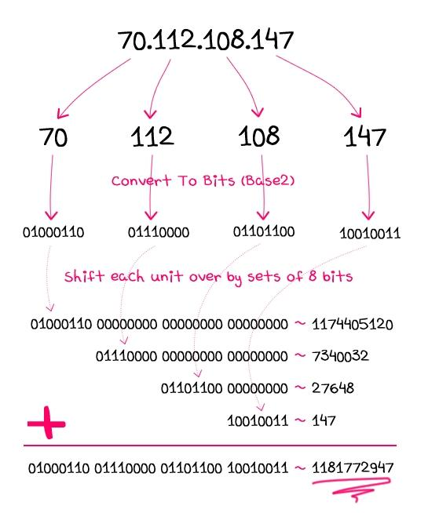

# Perl - pack y unpack

TAGS:

- [Development](Development.md)

SOURCES:

- <https://stackoverflow.com/questions/3857499/when-would-you-use-unpackh-or-packh>
- <https://perldoc.perl.org/functions/pack.html>
- <https://perldoc.perl.org/functions/unpack.html>
- <https://metacpan.org/pod/distribution/perl/pod/perlpacktut.pod>
- RC4 cipher example
    - <https://stackoverflow.com/questions/10538253/in-perl-while-using-rc4-i-am-unable-to-get-back-the-encrypted-text>
    - <https://stackoverflow.com/questions/10085621/issue-with-encrypting-password-using-cryptrc4>
    - <http://graphcomp.com/info/crypt/rc4.htm>
- CGI download file
    - <https://www.nu42.com/2012/05/file-download-cgi-script-in-perl.html>

---

## pack TEMPLATE,LIST

Converts values to a byte sequence containing representations according to a given specification, the "template" argument.

- Takes a LIST of values and converts it into a string using the rules given by the TEMPLATE. The resulting string is the concatenation of the converted values.
- go from several pieces of data to one fixed-width version

## unpack TEMPLATE,EXPR

Derives some values from the contents of a string of bytes. The string is broken into chunks described by the TEMPLATE. Each chunk is converted separately to a value.

- Takes a string and expands it out into a list of values. (In scalar context, it returns merely the first value produced.)
- If EXPR is omitted, unpacks the $_ string.
- Not all that has been packed together can be neatly unpacked!
- turn a fixed-width-format string into several pieces of data.

## TEMPLATE

- **Strings**
    - a -> a string with arbitrary binary data, will be null padded.
        - A -> a text (ASCII) string, will be space padded
        - A means "any character"
    - Z -> a null-terminated (ASCIZ) string, will be null padded.
    - c -> a signed char (8-bit) value.
        - C -> an unsigned char (octet) value.
    - U -> a Unicode character number. Encodes to a character in character mode and UTF-8 (or UTF-EBCDIC in EBCDIC platforms) in byte mode
- **Integers big-endian byte-order**: <mark>use these pack codes if you exchange binary data, across the network, with some system that you know next to nothing about</mark>. This order has been chosen as the **network order**.
    - n -> an unsigned short (16-bit) in "network" (big-endian) order.
        - N -> an unsigned long (32-bit) in "network" (big-endian) order.
- **Integers little-endian byte-order**
    - v -> an unsigned short (16-bit) in "VAX" (little-endian) order.
        - V -> an unsigned long (32-bit) in "VAX" (little-endian) order.
- **Integer pack codes that result in fixed number of bytes**: non-portable between processors and operating systems because they obey native byte-order and [Endianness](Endianness.md)
    - s -> a signed short (16-bit) value.
        - S -> an unsigned short value.
    - l -> a  signed long (32-bit) value.
        - L -> an unsigned long value.
    - q -> a signed quad (64-bit) value.
        - Q -> an unsigned quad value.
        - (Quads are available only if your system supports 64-bit integer values *and* if Perl has been compiled to support those. Raises an exception otherwise.)
- **Integer pack codes that depends on the local C compiler**: portable way to pass data structures between Perl and C programs (bound to happen when you call XS extensions or the Perl function syscall), or when you read or write binary files
    - i -> a signed integer value.
        - I -> an unsigned integer value.
        - (This 'integer' is *at least* 32 bits wide. Its exact size depends on what a local C compiler calls 'int'.)
- **Hexadecimal**: A nibble or nybble is a four-bit aggregation, or half an octet
    - h -> a hex string (low nybble first)
        - H -> a hex string (high nybble first) The first character of the pair determines the most-significant nybble
- **Floating point numbers**
    - f -> a single-precision float in native format.
        - F -> a Perl internal floating-point value (NV) in native format
    - d -> a double-precision float in native format.
        - D -> a float of long-double precision in native format.
        - (Long doubles are available only if your system supports long double values *and* if Perl has been compiled to support those. Raises an exception otherwise. There are different long double formats.)
- `x` -> a null byte, ASCII NUL, `\000` or `chr(0)`
    - `x` means "skip a byte forward" when unpacking; when packing, it means "introduce a null byte"
    - `X` -> back up a byte
        - `X` means "skip a byte back" when unpacking
- `/` -> the packed structure contains a packed item count followed by the packed items themselves
    - For pack, you write length-item/sequence-item, and the length-item describes how the length value is packed
- Repetitions
    - You can follow the formats with numbers to say how many characters should be affected by that format
        - A12 means "take 12 characters"
        - x6 means "skip 6 bytes" or "character 0, 6 times".
    - Instead of a number, you can use `*` to mean "consume everything else left".
        - When packing multiple pieces of data, `*` only means "consume all of the current piece of data"
        - `pack("A*A*", $one, $two)` packs all of `$one` into the first `A*` and then all of `$two` into the second
        - Each format character corresponds to one piece of data to be packed.
- Template Grouping
    - Prior to Perl 5.8, repetitions of templates had to be made by x-multiplication of template strings.
    - ( and ) combined with a repeat count
- Modifiers
    - `! sSlLiI` -> Force native (short, long, int) sizes instead of fixed (16-/32-bit) sizes.
    - `> sSiIlLqQjJfFdDpP` -> Force big-endian byte-order on the type (The "big end" touches the construct.)
    - `< sSiIlLqQjJfFdDpP` -> Force little-endian byte-order on the type (The "little end" touches the construct.)
- Only for unpack
    - `%<number>` -> indicate that you want a `<number>`-bit checksum of the items instead of the items themselves.
        - Default is a 16-bit checksum.
        - The checksum is calculated by summing numeric values of expanded values (for string fields the sum oford(`$char`) is taken; for bit fields the sum of zeroes and ones).

## Packing hexadecimal strings

```perl
# packing byte contents from a list of ten 2-digit hexadecimal strings
# the pack template contains ten pack codes
print pack( 'H2' x 10, 30..39 ); #prints 0123456789 on a computer with ASCII character coding

# unpacking byte contents to a list of ten 2-digit hexadecimal strings
print join ' ', unpack( 'H2' x 10, '0123456789' ); #prints 30 31 32 33 34 35 36 37 38 39
```

## Packing text (fixed-width data)

```text
        1         2         3         4         5
1234567890123456789012345678901234567890123456789012345678

Date      |Description                | Income|Expenditure
01/24/2001 Zed's Camel Emporium                    1147.99
01/28/2001 Flea spray                                24.99
01/29/2001 Camel rides to tourists      235.00
```

```perl
my ($date, $desc, $income, $expend) = unpack("A10xA27xA7A*", $_);
```

- We can see that the date column stretches from column 1 to column 10 - ten characters wide. -> **A10**
- Between the date and the description is a blank column; we want to skip over that. -> **x**
- We have another batch of characters, from 12 to 38. That's 27 more characters -> **A27**
- skip another character -> **x**
- pick up the next 7 characters -> **A7**
- Lines which are just income and not expenditure might end at column 46. We'll just say "if there's anything left, take it". -> **A***

If the unpack template doesn't match the incoming data, Perl will scream and die.

```perl
print pack("A10xA27xA7xA*", $today, "Totals", $tot_income, $tot_expend);
```

```text
01/24/2001 Zed's Camel Emporium                    1147.99
01/28/2001 Flea spray                                24.99
01/29/2001 Camel rides to tourists      235.00
03/23/2001Totals                     1235.001172.98
```

What we actually need to do is expand the width of the fields.

```perl
#put spaces in the template to make it more readable, they don't output
print pack("A11 A28 A8 A*", $today, "Totals", $tot_income, $tot_expend);
```

```text
01/24/2001 Zed's Camel Emporium                    1147.99
01/28/2001 Flea spray                                24.99
01/29/2001 Camel rides to tourists      235.00
03/23/2001 Totals                      1235.00 1172.98
```

The last column which needs to be moved further over. Format with sprintf.

```perl
$tot_income = sprintf("%.2f", $tot_income);
$tot_expend = sprintf("%12.2f", $tot_expend);
```

```text
01/24/2001 Zed's Camel Emporium                    1147.99
01/28/2001 Flea spray                                24.99
01/29/2001 Camel rides to tourists      235.00
03/23/2001 Totals                      1235.00     1172.98
```

## Packing integers

Packing and unpacking numbers implies conversion to and from some specific binary representation:

- number of bytes used for storing the integer,
- whether the contents are interpreted as a signed or unsigned number,
- byte ordering: whether the first byte is the least or most significant byte (little-endian or big-endian).

```perl
my $ps = pack( 's', 20302 ); # pack 20302 to a signed 16 bit integer in your computer's representation
```

The result is a string, now containing 2 bytes. If you print this string you might see ON or NO (depending on your system's byte ordering) - or something entirely different if your computer doesn't use ASCII character encoding.

```perl
my ( $s ) = unpack( 's', $ps ); # returns the original integer value
```

> ATTENTION: if the packed value exceeds the allotted byte capacity, high order bits are silently discarded, and unpack certainly won't be able to pull them back. When you pack using a signed template code such as s, an excess value may result in the sign bit getting set, and unpacking this will smartly return a negative value.

## Packing integers for "networking"

The pack code for **big-endian** (high order byte at the lowest address) is `n` for 16 bit and `N` for 32 bit integers

You should also use these pack codes if you exchange *binary data, across the network*, with some system that you know next to nothing about. The simple reason is that this order has been chosen as the **network order**, and all standard-fearing programs ought to follow this convention.

```perl
# send a message by sending the length first, followed by just so many bytes:
my $buf = pack( 'N', length( $msg ) ) . $msg;
#or...
my $buf = pack( 'NA*', length( $msg ), $msg );
```

Some protocols demand that the count should include the length of the count itself: then just add 4 to the data length. (But make sure to read [Lengths and Widths](https://metacpan.org/pod/distribution/perl/pod/perlpacktut.pod#Lengths-and-Widths) before you really code this!)

### Byte-order modifiers

```perl
# unpack a sequence of signed big-endian 16-bit integers in a platform-independent way
my @data = unpack 's*', pack 'S*', unpack 'n*', $buf;
```

unpack an unsigned short (16-bit) in "network" (big-endian) order, then pack it as an unsigned short value to finally unpack it as a signed short (16-bit) value.

As of Perl 5.9.2, there's a much nicer way to express your desire for a certain byte-order:

- `>` is the big-endian modifier
- `<` is the little-endian modifier

```perl
my @data = unpack 's>*', $buf;
# the "big end" of the arrow touches the s, which is a nice way to remember that > is the big-endian modifier.
```

## Unicode

The [UTF-8](UTF-8.md) encoding stores the most common (from a western point of view) characters in a single byte while encoding the rarer ones in three or more bytes. Perl uses UTF-8, internally, for most [Unicode](Unicode.md) strings.

```perl
# Equivalent to: $UTF8{Euro} = "\x{20ac}"; #Unicode codepoint number
$UTF8{Euro} = pack( 'U', 0x20AC );
# $UTF8{Euro} contains 3 bytes: "\xe2\x82\xac"
# However, it contains only 1 character, number 0x20AC.
$Unicode{Euro} = unpack( 'U', $UTF8{Euro} );
```

Usually you'll want to pack or unpack UTF-8 strings:

```perl
# pack and unpack the Hebrew alphabet
my $alefbet = pack( 'U*', 0x05d0..0x05ea );
my @hebrew = unpack( 'U*', $utf );
```

These functions provide means of handling invalid byte sequences and generally have a friendlier interface:

- `Encode::decode('UTF-8', $utf)` to decode a UTF-8 encoded byte string to a Perl Unicode string
- `Encode::encode('UTF-8', $str)` to encode a Perl Unicode string to UTF-8 bytes

## Template Grouping

```perl
# return a string consisting of the first character from each string
join( '', map( substr( $_, 0, 1 ), @str ) )
pack( '(A)'.@str, @str )

# a repeat count * means "repeat as often as required"
pack( '(A)*', @str )
```

OBS: Note that the template `A*` would only have packed `$str[0]` in full length.

## String Lengths

Packing a length followed by so many bytes of data is a frequently used recipe since appending a null byte won't work if a null byte may be part of the data

```perl
# pack a short message: ASCIIZ, ASCIIZ, length, string
my $msg = pack( 'Z*Z*CA*', $src, $dst, length( $sm ), $sm );
( $src, $dst, $len, $sm ) = unpack( 'Z*Z*CA*', $msg );
```

Adding another field after the Short Message (in variable `$sm`) is all right when packing, but this cannot be unpacked naively. To solve this:

```perl
# pack a short message: ASCIIZ, ASCIIZ, length/string, byte
my $msg = pack( 'Z* Z* C/A* C', $src, $dst, $sm, $prio );
( $src, $dst, $sm, $prio ) = unpack( 'Z* Z* C/A* C', $msg );
```

Combining two pack codes with a slash (/) associates them with a single value from the argument list.

- In pack, the length of the argument is taken and packed according to the first code while the argument itself is added after being converted with the template code after the slash
    - This saves us the trouble of inserting the length call
- In unpack, the value of the length byte marks the end of the string to be taken from the buffer. Since this combination doesn't make sense except when the second pack code isn't `a*`, `A*` or `Z*`, Perl won't let you.

The pack code preceding / may be anything that's fit to represent a number: All the numeric binary pack codes, and even text codes such as `A4` or `Z*`

```perl
# pack/unpack a string preceded by its length in ASCII
my $buf = pack( 'A4/A*', "Humpty-Dumpty" );
# unpack $buf: '13  Humpty-Dumpty'
my $txt = unpack( 'A4/A*', $buf );
```

## Dynamic Templates

If the list of pack items doesn't have fixed length, an expression constructing the template is required (whenever, for some reason, `()*` cannot be used)

To store named string values in a way that can be conveniently parsed by a C program, we create a sequence of names and null terminated ASCII strings, with = between the name and the value, followed by an additional delimiting null byte.

```perl
my $env = pack( '(A*A*Z*)' . keys( %Env ) . 'C',
          map( { ( $_, '=', $Env{$_} ) } keys( %Env ) ), 0 );
```

- the map call creates the items we intend to stuff into the `$env` buffer: to each key (in `$_`) it adds the = separator and the hash entry value
- each triplet is packed with the template code sequence `A*A*Z*` that is repeated according to the number of keys.
- To get the very last null byte, we add a 0 at the end of the pack list, to be packed with C.

For the reverse operation, we'll have to determine the number of items in the buffer before we can let unpack rip it apart:

```perl
my $n = $env =~ tr/\0// - 1;
my %env = map( split( /=/, $_ ), unpack( "(Z*)$n", $env ) );
```

The tr counts the null bytes. The unpackcall returns a list of name-value pairs each of which is taken apart in the map block.

### Counting Repetitions

Precede the data with a count. Again, we pack keys and values of a hash, preceding each with an unsigned short length count, and up front we store the number of pairs:

```perl
my $env = pack( 'S(S/A* S/A*)*', scalar keys( %Env ), %Env );
my %env = unpack( 'S/(S/A* S/A*)', $env );
# you cannot use the same template for pack and unpack because pack can't determine a repeat count for a ()-group.
```

## Pack Recipes

```perl
# Convert IP address for socket functions
pack( "C4", split /\./, "123.4.5.6" );

# Count the number of set bits in a bit vector
unpack( '%32b*', $mask );

# Determine the endianness of your system
$is_little_endian = unpack( 'c', pack( 's', 1 ) );
$is_big_endian = unpack( 'xc', pack( 's', 1 ) );

# Determine the number of bits in a native integer
$bits = unpack( '%32I!', ~0 );

# Prepare argument for the nanosleep system call
my $timespec = pack( 'L!L!', $secs, $nanosecs );
```

## Hexadecimal to/from bytes

```perl
# H: A hex string (high nybble first).
my $buf = "\x12\x34\x56\x78";
print unpack('H*', $buf); # prints 12345678

# NOT RECOMMENDED!!!
# h: A hex string (low nybble first).
print unpack('h*', $buf); # prints 21436587
```

## Hexadecimal pack/unpack + RC4

```perl
# cifrado RC4 del texto plano con una palabra clave
my $encrypted = RC4($passphrase, $plaintext);

# el texto cifrado se considera como un string de bytes y lee como caracteres hexadecimales
my $encrypted_hex = unpack('H*', $encrypted);

# el dato cifrado y pasado a hexa, se vuelve a convertir en un string de bytes
my $encrypted_from_hex = pack('H*', $encrypted_hex);

#el string de bytes es en realidad un cifrado RC4, a partir del cual se obtiene el texto plano
my $decrypted = RC4($passphrase, $encrypted_from_hex);
```

[crypt-rc4.pl](../attachments/crypt-rc4.pl)

## Divide content in binary data blocks of the same size

```perl
my $size = 4096;#tamaño de un bloque
my $blocks = (length($data)/$n) -1; #cantidad de bloques con 4096 bytes

# el string de contenido lo divide en bloques de datos binarios
my @groups = unpack "a$size" x $blocks . "a*", $data;
print $_ for ( @groups );
```

- [sample-serve-image.cgi](../attachments/sample-serve-image.cgi)
- [sample-serve-image-delay.cgi](../attachments/sample-serve-image-delay.cgi) to appreciate how data blocks are returned
- [sample-serve-ics.cgi](../attachments/sample-serve-ics.cgi)
- [sample-serve-ics-delay.cgi](../attachments/sample-serve-ics-delay.cgi) to appreciate how data blocks are returned

## IPv4 to/from decimal

> Dirección IP v4 (4 octetos separados por .) <-> decimal

Una dirección ip v4 está formada por 32 bits. Por lo tanto el entero a generar debe ser de 32 bits porque de lo contrario se perdería información!

- `L` -> an unsigned long (32-bit) value
    - *NOT RECOMMENDED!!!* - non-portable between processors and operating systems because they obey native byte-order and endianness
- `N` -> an unsigned long (32-bit) in "network" (big-endian) order

```perl
unpack N => pack CCCC => split /\./ => shift; #ip2dec

join '.', unpack CCCC, pack N, shift; #dec2ip
```

### ip2dec separado en partes documentadas

```perl
my $ip = shift;
my @octets = split /\./, $ip;

# pack converts values to a byte sequence
my $bytes = pack 'CCCC', @octets; # C  An unsigned char (octet) value.

# unpack derives value from the contents of a string of bytes
my ( $dec ) = unpack 'N', $bytes; # N  An unsigned long (32-bit) in "network" (big-endian) order.
```

### ip2dec - variantes de one-liner

```perl
# indicar la cantidad de caracteres en el template
unpack N => pack C4 => split /\./ => shift;

# => es el operador fat coma, el cual se puede reemplazar por la coma ,
unpack N , pack C4 , split /\./ , shift;

# agregar paréntesis para claridad
unpack(N , pack (C4 , split(/\./ , shift)));

# el template es un string, agregar comillas para claridad
unpack('N' , pack ('C4' , split(/\./ , shift)));

# Se puede reemplazar la cantidad de caracteres del template  por * para indicar hasta el final
# OBS: Si el template no está entre comillas * genera un error de compilación!
unpack('N' , pack ('C*' , split(/\./ , shift)));
```

### Prueba en línea de comandos

```perl
perl -e "print unpack N => pack CCCC => split /\./ => shift;" 192.168.0.1 #prints 3232235521

perl -e "print join '.', unpack CCCC, pack N, shift;" 3232235521 #prints 192.168.0.1
```



Image obtained from [Converting IP Addresses To And From Integer Values With ColdFusion](https://www.bennadel.com/blog/1830-converting-ip-addresses-to-and-from-integer-values-with-coldfusion.htm)

[ip2dec2ip.pl](../attachments/ip2dec2ip.pl)
