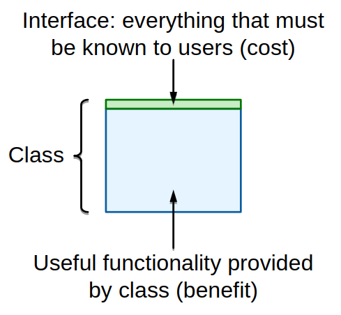
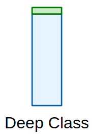
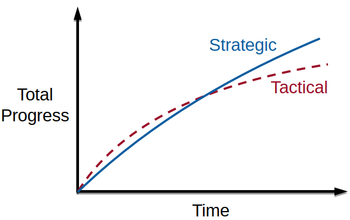

# Philosophy of Software Design

## Problem decomposition

This is the most important thing in computer science: How do you take a complicated problem or system and chop it up into pieces that you can build relatively independently?

The whole idea behind software design is we're doing things for the future. We're doing things today to make it easier for us to develop in the future. And you have to think a little bit ahead. Although, of course, you know the classic problem with software is *we can't visualize the future very well*. So it's dangerous to try and think too far ahead.

Some programmers are way, way more productive than others. Google has coined the term the *10x programmer*. The only thing that really differentiates the top performers from the average performers is how much they've **practiced** (from "Talent Is Overrated" by Geoff Colvin). No one attempts to teach these skills either.

## The red flags

Red flags are very specific things that, if you see this sort of behavior or pattern, you're probably in trouble. Even if you don't know how to design the right system, if you can see you're going wrong, then just try something else until eventually the red flags go away. And you'll probably end up in a pretty decent place.

## Classes Should be Deep

Reformulation of classic Parnas paper: [On the Criteria To Be Used in Decomposing Systems into Modules](On-the-Criteria-To-Be-Used-in-Decomposing-Systems-into-Modules.md)

The area of the rectangle is the functionality that class provides. That's the benefit that the class provides to the rest of the system. Then think about the top edge as that's the *interface to the class*: everything someone has to have in their mind in order to use that class. It's not just the signatures for the functions, but things like side effects and dependencies and things like that. That's really the complexity cost that this class imposes on the rest of the system. So we'd like that to be as small as possible.

So ideally, what you'd like is the greatest benefit, least cost: <mark>the smallest interface and then the largest area</mark>.

A **deep class** has a very simple interface with a very large amount of functionality underneath it.

<mark>Deep classes are good abstractions</mark>. You can apply this to methods within classes, to interfaces in general or modules in a system or subsystems, anything like that that has an interface or an implementation.

The opposite of that I call a **shallow class**. That's something that has either not a whole lot of functionality or really, really complicated interface or both. Those classes, they just don't give us much leverage against complexity.

### Classitis

**Common wisdom**: "classes and methods should be small". One of the biggest mistakes people make: too many, too small, too shallow classes.

It is when somebody says classes are good and somebody else thought what they heard that more classes are better. So your goal is to have as many small classes as possible where each class adds the tiniest possible amount of new functionality to the previous classes.

**Length is really not the fundamental issues**. I don't have problems with methods that are hundreds of lines long if they're relatively clean and if they have a deep interface to them. **It's abstraction**. So rather than striving for length, you should first try and get these deep abstractions. And then if you end up with something that's really big and long, then see if you can chop it up.

## Define Errors Out of Existence

**Common wisdom**: detect and throw as many errors as possible

Exceptions are a huge source of complexity in systems. You're taught to program defensively, which is good. But people then think:

> "I should be throwing lots of exceptions. The more exceptions I'm throwing, the better defense I'm doing. And as long as I, building my module, catch all the errors and heave them up in the air as exceptions, I don't have to worry about where they land or who's going to deal with them. I've done my job.

**Redefine the semantics**, so that there is no error, to eliminate exceptions. Just make the normal behavior always do the right thing. Also, **minimize the number of places** where exceptions must be handled.

### Redefining semantics

- In Windows, if you tried to delete a file when some process had the file open, that was not allowed. You start going around killing programs to try and make it so you delete the file. You just give up, and you reboot.
    - In Unix, if you delete a file while it's open, what happens is it deletes the file from the directory and from the namespace. It no longer appears anywhere in the file system. But the actual contents of the file still hang around, so that any process that's using the file can continue to access the file. And then when the last open instance of the file is closed, then finally it cleans up and throws away everything else.
- In Java, there're various methods that will extract a substring out of a string. If either of indices is outside the range of the substring they throw an exception. I end up, typically, having to write my own code to effectively clip my indices to the range of the string before I invoke the Java substring command, so I won't get these exceptions.
    - Instead, it'd be so much simpler just to return the overlap between the indices you've specified and the available contents of the string. So if both of the indices are outside the range of the string, it returns an empty string.

## Strategic vs. tactical programming

We try to avoid people from making mistakes, which it's kind of a noble thought. But the problem is that it's really hard to do. And so typically what happens is we introduce lots of complexity, which makes it hard to even do the right thing.

One of the biggest obstacles to good design is *mindset*. If you don't have the right mindset, you will just never produce a good design.

> "Strategy without tactics is the slowest route to victory. Tactics without strategy is the noise before defeat."
>
> -- Sun Tzu, "The Art of War"

### Tactical programming

Most people take the *wrong approach*, which is the tactical approach. Your goal is to get something working, your next feature, fixing a bug ASAP.

> I'll try and make it mostly clean but if I take a couple of shortcuts, as long as I don't do too many of them, that's what really counts.

The problem is that those kluges (clumsy or inelegant solutions to a problem) build up really fast. Because not only are you doing it, but everybody else on your team is doing it. And then after a while you start saying I probably shouldn't have made that decision back there, but we've got our next deadline we've got to hit. But then by the time the deadline is done, you've introduced so many kluges, you realize it's going to take weeks to fix all these. And you don't have time for that.

> Working code isn't enough: *must minimize complexity*

<mark>The problem is that complexity isn't one mistake you make. It's not a single big thing that makes the system complicated. It's hundreds or thousands of mistakes made by many people over a period of time.</mark> You don't notice it as it's happening, because it's just a bit at a time.

But then, even worse, once it's happened, it's almost impossible to fix. Because there's no one thing you can go back and fix to fix the problem. It's thousands of things in hundreds of places.
And so it's just so overwhelming, you never get to it.

#### Tactical tornado

This is an extreme of the tactical programmer, sort of a personality type. A person who turns out enormous amounts of pretty shoddy code that kind of 80% works at a huge rate and leaves a wake of destruction behind them.

Every organization has them. And in many organizations, these people are considered *heroes*. This is who management goes to when we need the new feature for tomorrow. And they'll have a feature tomorrow that works for most of the day tomorrow, anyhow.

### Strategic programming

Of course, things have to work. But that shouldn't be the real goal. Instead, you should take what I call a strategic approach where **the goal is a great design**, so that we can develop fast in the future.

So it's really all about investing. We'll invest in good design today, because most of the code we develop is going to be in the future. And so if we mess things up today, we're slowing ourselves down for the future.

You have to find ways to drive complexity out of the system. And, fundamentally you have to *sweat the small stuff*. Don't let those little bits of lint creep in. Because if they do, then you're going to slide back into a tactical mode again.

You're going to go slower first. Development will still slow down over time, because complexity is inevitable. We can't prevent it.
We can only kind of slow the growth as much as we can. But, eventually, you'll end up to be faster.

#### How to deal with layers?

We need layers for managing complexity. So in that sense, they're good. They do have problems for performance.

I think people do too many layers. And so I think that's a common mistake is just to throw in lots of skinny layers, rather than having a smaller number of meatier layers.

The other thing is that for cases where performance matters, if you think a little bit about what your key performance metrics are, I believe you can often define your layers in a way that
allows you to achieve very high performance even with layering.

### How Much To Invest?

- Take extra time today
- Pays back in the long run

Most startups are totally tactical: Pressure to get first products out quickly.

> Our financing is going to run out in six months. Whatever evil we put in, when we become famous and wealthy and do out IPO, we'll be able to hire more engineers to clean up this mess.

Unfortunately once you get that, it's pretty much impossible to repair damage.

Facebook is the poster child for this: "Move quickly and break things". This empowered developers but code base notoriously got incomprehensible/unstable. Eventually changed to "Move quickly with solid infrastructure"

You can be successful with crappy code. You can be tactical and build companies that succeed. But,

- you can also succeed with the other approach.
- if you really care about design, really do good coding, you will have a culture with a better position to recruit the best programmers.

#### Make continual small investments: 10-20% overhead

One of the problems of software is we can't visualize the way our systems are going to turn out. You have to use a somewhat iterative approach. Think of it in terms of small steps.

- When writing new code
    - Take a little bit of time to design the interface.
    - Try to come up with deep classes.
    - Write the documentation as you're going.
- When changing existing code
    - Always find something to improve, look for something you can make better.
    - *Don't settle for fewest modified lines of code*

Even when you're afraid, instead of thinking:

> "I don't understand this and I'm going to break something, so I'll make the fewest lines of change.

Ask yourself:

> "Is this the most I can afford to invest right now?"

Try and find a clean way of doing things. And ideally, in the best case, you'd like to end up where you would have ended up if you had built the whole system from scratch knowing what you know today.

You know you can't always do that. Sometimes that would be a refactoring that's way beyond the scale of what you can do. So, again, I would just say ask yourself, am I doing *the most I possibly can*?

## Linked Sources

- [A Philosophy of Software Design - Talks at Google](https://www.youtube.com/watch?v=bmSAYlu0NcY) - John Ousterhout
- [Can Great Programmers Be Taught?](https://cs.stanford.edu/~hq6/files/Great%20Programmers%20Long%20(Aug).pdf) - John Ousterhout
    - [Can-Great-Programmers-Be-Taught-2018-08-28.pdf](../attachments/Can-Great-Programmers-Be-Taught-2018-08-28.pdf)
- A Philosophy of Software Design - John Ousterhout - 2018
    - <https://github.com/rocky-191/Awesome-CS-Books/blob/master/SoftwareEngineering/Architecture/2018-John%20Ousterhout-A%20Philosophy%20of%20Software%20Design.pdf>
    - [A-Philosophy-of-Software-Design-John-Ousterhout-2018.pdf](../attachments/A-Philosophy-of-Software-Design-John-Ousterhout-2018.pdf)
