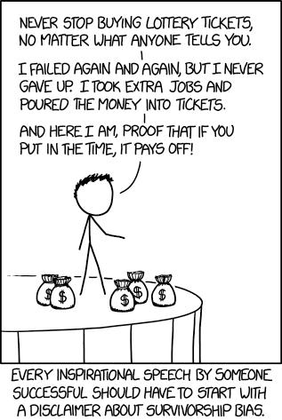

# Survivorship Bias

ALIAS: Survival bias, Sesgo del superviviente, Sesgo de supervivencia

SOURCES:

- <https://en.wikipedia.org/wiki/Survivorship_bias>
- [What you need to know about success stories - survivorship bias](https://cognitiontoday.com/what-you-need-to-know-about-success-stories-survivorship-bias/) - Aditya Shukla
- [21 Mind Traps : The Ultimate Guide to your most common Thinking errors (Part II)](https://www.youtube.com/watch?v=6G1F1KVeiNA)

---

**Survivorship bias** is the logical error of concentrating on data about the people or things that made it past some selection process and overlooking/ignoring those that did not, causing a biased view of the truth, not thinking that it is representative of only a subset of the population.

More simply, we tend to focus on those things that survived a process and overlook ones that failed. This can lead to some *false conclusions*:

- overly optimistic beliefs because failures are ignored, such as when companies that no longer exist are excluded from analyses of financial performance
- the false belief that the successes in a group have some special property, rather than just coincidence (correlation "proves" causality).
- thinking that an incident was not as dangerous as it was because everyone communicated with afterwards survived. Even if one knew that some people are dead, they would not have their voice to add to the conversation, leading to bias in the conversation.

When you are only focusing on the "winners", survivorship bias
causes you to underestimate the challenge and overestimate your chances of success.

## Structure

- X% of people successfully completed doing something and live to tell the story of how they did it. They often believe that the cause of success is what they did.
- (100 - X)% of people failed to succeed and probably did not survive to tell the story of how or what they did. Thus (100-X)% people are eliminated from the visibility of information.

We don't know what (100-X)% people did, perhaps the same thing as X, perhaps something different. Perhaps something that X avoided (but they don't know if they did, we have no comparison).

> **False conclusion**: Doing what X% people did had an effect on their success

## Examples

[Survivorship Bias - XKCD Comic](https://xkcd.com/1827/)

### The successful businessman

We hear success stories of people and it is intuitive to attribute the success to what they did to get there. But we do not know how many people did similar things as our survivor to get to the top and yet failed. Maybe for every 1 successful person who tries doing X, there are 40 others who failed doing X. Perhaps it was just about being there at the right place at the right time!

### The miracle healer

Shamans, Witch doctors, Baba, God-men, Spiritual healers, etc. all of them usually have clients who confirm their credibility. Some portion of people who seek alternative pseudo-medical help for a slow-killing disease like cancer will survive the illness for any number of reasons. The ones who don't are all those cases which couldn't be saved by these healers. But, when some survive, the story spreads. You only hear stories of people who could live to tell the story. Only if we could hear the stories of those who died, we'd have an objective view.

## Origin

During world war II, Abraham Wald, a statistician, made a smart logical inference which led to bomber planes lasting longer in the field.

He realized that planes that returned from battle had bullet holes all over them. Surely, one would think that the planes need better armor.

Abraham Wald noticed that planes with bullet holes had some hidden information in them. The ones that had holes at particular spots did not collapse in battle. The planes that did not return must've had bullet holes in some other spots that led to critical damage and thus the collapse of the plane. <mark>The pattern of bullet holes in survivor planes showed where the plane can get hit and survive</mark>.

So they built armor for places where the survivor planes did not take bullet hits. They knew those were the critical points. They reinforced the unscathed parts of the survivor planes.
